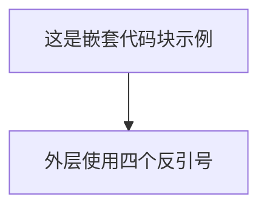
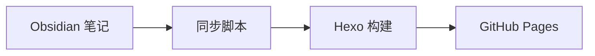
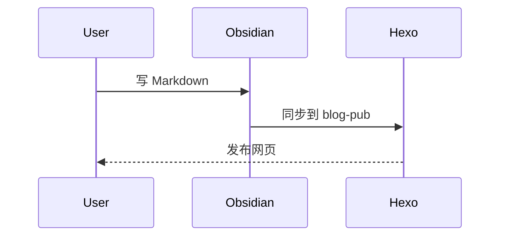

# Obsidian 语法显示测试

这篇文章用于测试 Obsidian 支持的 Markdown 语法在本地 Obsidian、同步脚本、Hexo 渲染和 GitHub Pages 页面中的显示效果。

建议观察：

- 哪些语法在 Obsidian 中显示正常，但在网页中原样暴露。
- 哪些语法会被 Hexo 正常渲染。
- 哪些语法需要主题 CSS 或同步脚本额外增强。

## 1. 基础 Markdown

这是一个普通段落。段落之间使用空行分隔。

这是第二个普通段落，包含 **加粗**、*斜体*、~~删除线~~、==Obsidian 高亮== 和 `行内代码`。

如果高亮语法 `==文本==` 在网页中没有变成高亮，说明 Hexo 当前 Markdown 渲染器没有处理 Obsidian 高亮扩展。

### 1.1 列表

- 无序列表第一项
- 无序列表第二项
  - 嵌套列表 A
  - 嵌套列表 B

1. 有序步骤一
2. 有序步骤二
3. 有序步骤三

### 1.2 任务列表

- [x] 已完成任务
- [ ] 未完成任务
- [?] Obsidian 允许用任意字符标记任务状态
- [-] 另一个非标准任务状态

## 2. Obsidian 内部链接

普通 Wiki 链接：[[欢迎]]

带别名的 Wiki 链接：[[终端工具配置指南|终端工具配置指南这篇笔记]]

链接到标题：[[更换ghostty配置步骤#3.使用]]

链接到块 ID：[[Obsidian语法显示测试#^test-block]]

这是一段带块 ID 的文字，供内部链接测试。 ^test-block

> [!note] 观察点
> 如果网页中 `[[欢迎]]` 仍然原样显示，说明当前发布链路还没有把 Obsidian Wiki 链接转换为网页链接。

## 3. Obsidian 嵌入语法

### 3.1 嵌入图片

下面使用 Obsidian 图片嵌入语法：


下面使用标准 Markdown 图片语法：


### 3.2 嵌入笔记

下面尝试嵌入另一篇笔记：

![[欢迎]]

> [!warning] 观察点
> `![[欢迎]]` 在 Obsidian 中可能会嵌入整篇笔记，但在 Hexo 网页中大概率不会自动展开。

## 4. Callout 标注块

> [!note] Note 普通备注
> 这是一个普通 note 标注块，用于承载补充说明。

> [!tip] Tip 小技巧
> 这是一个 tip 标注块，适合放推荐做法、快捷方式、经验技巧。

> [!warning] Warning 注意
> 这是一个 warning 标注块，适合放可能踩坑的地方。

> [!danger] Danger 高风险
> 这是一个 danger 标注块，适合放删除数据、覆盖文件、部署失败等高风险提醒。

> [!question] Question 问题
> 这是一个 question 标注块，适合放待思考问题。

> [!example] Example 示例
> 这是一个 example 标注块，适合放例子。

> [!todo] Todo 待办
> - [ ] 检查网页中 Callout 是否被识别
> - [ ] 检查标题是否显示
> - [ ] 检查列表是否在 Callout 内正常显示

> [!note]- 默认折叠 Callout
> 这是 Obsidian 的折叠语法。网页端如果不支持，可能会原样显示 `-`。

> [!note]+ 默认展开 Callout
> 这是 Obsidian 的默认展开语法。网页端如果不支持，可能会原样显示 `+`。

## 5. 普通引用

> 这是一段普通引用。
>
> 它不是 Callout，不应该被识别为 note、tip 或 warning。

## 6. 表格

| 语法            | Obsidian 预期 | 网页观察      |
| ------------- | ----------- | --------- |
| `[[欢迎]]`      | 内部链接        | 是否原样显示    |
| `` | 嵌入图片        | 是否转换为网页图片 |
| `==高亮==`      | 高亮文本        | 是否变成高亮    |
| `> [!tip]`    | Callout     | 是否变成提示卡片  |

### 6.1 表格对齐

| 左对齐 | 居中 | 右对齐 |
| :-- | :--: | --: |
| left | center | right |
| 中文左对齐 | 中文居中 | 中文右对齐 |

### 6.2 表格中的竖线转义

| 场景           | 写法                        |
| ------------ | ------------------------- |
| 带别名的 Wiki 链接 | `[[基本格式语法\|Markdown 语法]]` |
| 图片指定宽度       | `![[image.png\|400]]`     |

## 7. 代码块

行内代码：`npm run build`

```bash
npm install
npm run build
npm run server -- --port 4021
```

```js
function greet(name) {
  return `Hello, ${name}`;
}

console.log(greet("Obsidian"));
```

````md

````

## 8. Mermaid 图表





## 9. 数学公式

行内公式：$e^{i\pi}+1=0$

块级公式：

$$
\int_a^b f(x)\,dx = F(b)-F(a)
$$

矩阵示例：

$$
\begin{bmatrix}
1 & 2 \\
3 & 4
\end{bmatrix}
$$

## 10. 脚注

这是一个普通脚注引用[^normal-footnote]。

这是一个行内脚注。^[这是 Obsidian 支持的行内脚注。]

[^normal-footnote]: 这是普通脚注内容。它应该出现在文末脚注区域。

## 11. Obsidian 注释

下面这一段是 Obsidian 注释，理论上只在编辑模式中可见：

%% 这是一个行内 Obsidian 注释。 %%

%%
这是一个多行 Obsidian 注释。
如果网页中显示出来，说明发布链路没有移除 Obsidian 注释。
%%

## 12. HTML 内 Markdown 测试

Obsidian 官方说明：HTML 元素内部的 Markdown 不会被 Obsidian 渲染。

<div>
这里的 **加粗**、`行内代码`、[[内部链接]] 可能不会按 Markdown 渲染。
</div>

## 13. 转义字符

\*这段文本不应该变成斜体\*

\# 这行不应该变成标题

表格中的管道符需要写成 `\|`。

## 14. 发布兼容性总结

> [!info] 测试结论填写区
> 发布后可以在这里记录每种语法的表现：
>
> - Obsidian 高亮：
> - Wiki 链接：
> - 图片嵌入：
> - Callout：
> - Mermaid：
> - 数学公式：
> - 脚注：
> - 注释：
